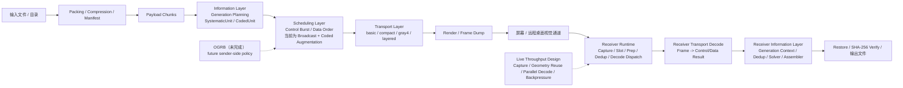

# screen-airdrop

`screen-airdrop` 通过远程桌面可见屏幕传输文件：发送端把文件编码成视觉帧并持续显示，接收端通过截屏、定位、解码和恢复把文件重建到本机。系统不依赖共享目录、驱动器映射、剪贴板文件传输或网络文件通道。

当前分支已经不是一个“简单 QR code 播放器”。它是一个分层的视觉传输系统，包含：

1. `information layer`
   - `generation`、`SystematicUnit`、`CodedUnit`
   - generation-local 恢复语义
2. `scheduling layer`
   - control burst、data ordering
   - sender-side OGRB 的未来接入点
3. `visual transport layer`
   - `basic / compact / gray4 / layered`
4. `receiver runtime`
   - live capture、prep/dedup、geometry reuse、parallel decode、bounded backpressure

## 当前状态

当前实现已经具备：

1. 完整 sender/receiver pipeline
2. `screen / replay / simulated_live` 三种 receiver 模式
3. generation-aware information model
4. GF(256) 擦除恢复基线
5. 围绕 live 吞吐的 runtime 设计

当前尚未完成：

1. sender-side OGRB lifecycle / fairness / overlap policy
2. coded path 的默认产品化
3. 不同 transport family 下的 coded live 默认路径

最准确的描述是：

1. 当前已经有正式的 erasure baseline
2. 当前还没有完成最终 OGRB 调度层

## 系统总图



## 快速开始

安装开发依赖：

```bash
uv sync --group dev
```

发送端：

```bash
uv run screen-airdrop-sender ./path/to/input --window-name "screen-airdrop"
```

接收端：

```bash
uv run screen-airdrop-receiver \
  --source screen \
  --window-title "Remote Desktop" \
  --output-dir ./recovered
```

离线回放：

```bash
uv run screen-airdrop-receiver \
  --source replay \
  --frames-dir ./frames \
  --output-dir ./recovered
```

模拟 live：

```bash
uv run screen-airdrop-receiver \
  --source simulated_live \
  --frames-dir ./frames \
  --output-dir ./recovered
```

## 常用命令

运行全部测试：

```bash
uv run pytest
```

运行单个测试文件：

```bash
uv run pytest tests/unit/test_protocol.py
```

按 marker 运行：

```bash
uv run pytest -m "not real_data and not regression_data"
```

Lint：

```bash
uv run ruff check src tests
uv run ruff format src tests
```

类型检查：

```bash
uv run pyright
```

## 架构概览

### Sender

发送端负责：

1. 打包与压缩
2. payload chunking
3. generation planning
4. systematic / coded unit 构造
5. control plane 与 data plane 调度
6. transport-specific frame encode
7. render 或 frame dump

当前 sender 已经支持：

1. `session / layout / generation` 控制面
2. generation-aware systematic path
3. opt-in 的 coded emission
4. `basic / compact / gray4 / layered` transport family

当前 sender 还不支持：

1. 完整 OGRB active generation lifecycle
2. fairness / coded budget / overlap-aware revisit

### Receiver

接收端负责：

1. frame source 管理
2. ROI / locate / geometry tracking
3. transport decode
4. control-plane state update
5. systematic / coded unit ingest
6. generation-local solver / assembler
7. restore 与 SHA-256 verify

receiver 当前有三种模式：

1. `screen`
   - 真实屏幕采集
2. `replay`
   - 离线回放
3. `simulated_live`
   - 用离线帧模拟 live runtime

### Live Throughput

live 模式下的高吞吐设计重点不在单一 decoder，而在整条 runtime 流水线：

1. dedicated capture loop
2. shared-memory slot
3. fingerprint dedup / prep
4. geometry reuse
5. parallel decode workers
6. coordinator event routing
7. bounded backpressure

当前 live 设计的目标不是单纯提高 `raw fps`，而是提高单位时间内新增的有效恢复进度。

## 协议与恢复

当前 transport family：

1. `basic`
   - 最清楚、最稳定的 baseline
2. `compact`
   - geometry efficiency 优化
3. `gray4`
   - 更强 modulation / calibration 路线
4. `layered`
   - 更正式的 control/data layering 与帧内保护结构

当前信息层恢复能力：

1. generation-local systematic / coded distinction
2. `GF256_SEED_V2` 作为正式 coded baseline
3. receiver 侧 GF(256) solver
4. replay-heavy 的擦除恢复验证

当前边界：

1. coded path 仍依赖 generation context
2. strongest proof 主要集中在 `basic` 回放链路
3. sender-side OGRB 仍未落地

## 代码结构

核心目录：

1. `src/screen_airdrop/common`
   - control plane、information objects、transport shared logic
2. `src/screen_airdrop/sender`
   - sender application / information / scheduling / transport / render
3. `src/screen_airdrop/receiver`
   - receiver pipeline / runtime / transport / information / reporting / roi / locator
4. `tests/unit`
   - 纯逻辑测试
5. `tests/integration`
   - loopback、loss、replay、erasure 恢复测试
6. `tests/e2e`
   - 真实数据集测试

## Benchmark

运行 replay / decode / end-to-end benchmark：

```bash
uv run python bench/compare_protocols.py --protocol all --ecc Q --payload-mode fixed --payload-size 500
uv run python bench/compare_decode_real.py --protocol all --iterations 15
uv run python bench/compare_end_to_end.py --mode replay --protocol all --ecc Q --payload-mode fixed --payload-size 500
uv run python bench/summarize.py
```

输出文件位于：

1. `bench/results/synthetic_cpu_benchmark_*.json`
2. `bench/results/real_frame_decode_benchmark_*.json`
3. `bench/results/end_to_end_*_benchmark_*.json`
4. `bench/results/summary.md`

## 文档入口

如果要理解当前分支的设计与边界，建议阅读：

1. [交付说明与当前实现状态](./docs/delivery_handoff_current_status.md)
2. [OGRB Protocol Specification](./docs/ogrb_specification.md)
3. [Erasure and OGRB Skeleton Plan](./docs/erasure_ogrb_skeleton_plan.md)
4. [Architecture Refactor Plan](./docs/architecture_refactor_plan.md)
5. [Gray4 Layered Full ECC Design](./docs/gray4_layered_full_ecc_design.md)
6. [Protocol Efficiency Report](./docs/protocol_efficiency_report.md)
