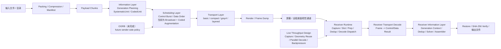

# Screen-Airdrop 交付说明与当前实现状态

更新时间：2026-04-17  
适用分支：`codex/OGRB`  
读者：准备评估、接入或复用当前系统的工程同事

## 1. 文档目的

这份文档不是协议规范，也不是一次性的 PR 摘要。它的目标是把项目迭代到当前状态的设计思路、工程边界、可交付能力和未完成工作系统地说明清楚，方便：

1. 对外展示目前已经做到的程度
2. 解释为什么系统已经不再只是“简单 QR code 播放器”
3. 帮助其他系统评估是否可以先对接当前版本
4. 明确哪些部分已经可用，哪些部分还在设计或实验阶段

如果只需要看规范草案或后续工作边界，请配合阅读：

1. [OGRB Protocol Specification](./ogrb_specification.md)
2. [Erasure and OGRB Skeleton Plan](./erasure_ogrb_skeleton_plan.md)
3. [Architecture Refactor Plan](./architecture_refactor_plan.md)
4. [Gray4 Layered Full ECC Design](./gray4_layered_full_ecc_design.md)
5. [Protocol Efficiency Report](./protocol_efficiency_report.md)

### 1.1 主要参考入口

如果对方需要从文档快速跳到实现，建议优先从下面这些入口开始：

1. sender 主流程
   - [sender/application/controller.py](/Users/waldron/Code/screen-airdrop/src/screen_airdrop/sender/application/controller.py)
   - [sender/application/frame_stream.py](/Users/waldron/Code/screen-airdrop/src/screen_airdrop/sender/application/frame_stream.py)
2. receiver 主流程
   - [receiver/cli.py](/Users/waldron/Code/screen-airdrop/src/screen_airdrop/receiver/cli.py)
   - [receiver/application/pipeline_factory.py](/Users/waldron/Code/screen-airdrop/src/screen_airdrop/receiver/application/pipeline_factory.py)
   - [receiver/pipeline/factory.py](/Users/waldron/Code/screen-airdrop/src/screen_airdrop/receiver/pipeline/factory.py)
3. control plane 与信息层对象
   - [common/control_plane.py](/Users/waldron/Code/screen-airdrop/src/screen_airdrop/common/control_plane.py)
   - [common/information/units.py](/Users/waldron/Code/screen-airdrop/src/screen_airdrop/common/information/units.py)
   - [common/information/identities.py](/Users/waldron/Code/screen-airdrop/src/screen_airdrop/common/information/identities.py)
4. coded payload 与恢复
   - [common/transport/coded_payload.py](/Users/waldron/Code/screen-airdrop/src/screen_airdrop/common/transport/coded_payload.py)
   - [sender/information/coded_builder.py](/Users/waldron/Code/screen-airdrop/src/screen_airdrop/sender/information/coded_builder.py)
   - [receiver/information/decoder.py](/Users/waldron/Code/screen-airdrop/src/screen_airdrop/receiver/information/decoder.py)
   - [receiver/information/solver_state.py](/Users/waldron/Code/screen-airdrop/src/screen_airdrop/receiver/information/solver_state.py)
   - [receiver/information/assembler.py](/Users/waldron/Code/screen-airdrop/src/screen_airdrop/receiver/information/assembler.py)
5. transport family
   - [common/transport/protocol_basic.py](/Users/waldron/Code/screen-airdrop/src/screen_airdrop/common/transport/protocol_basic.py)
   - [common/transport/protocol_gray4.py](/Users/waldron/Code/screen-airdrop/src/screen_airdrop/common/transport/protocol_gray4.py)
   - [common/transport/protocol_layered.py](/Users/waldron/Code/screen-airdrop/src/screen_airdrop/common/transport/protocol_layered.py)

## 2. 目录

1. [文档目的](#1-文档目的)
2. [目录](#2-目录)
3. [执行摘要](#3-执行摘要)
4. [为什么我们没有继续走简单 QR code 方案](#4-为什么我们没有继续走简单-qr-code-方案)
5. [系统分层模型](#5-系统分层模型)
6. [演进路线总览](#6-演进路线总览)
7. [Sender Pipeline](#7-sender-pipeline)
8. [Receiver Pipeline](#8-receiver-pipeline)
9. [协议族与使用建议](#9-协议族与使用建议)
10. [冗余、纠错与恢复：当前采取了哪些层次](#10-冗余纠错与恢复当前采取了哪些层次)
11. [当前擦除码为什么说“可用，但不是最终形态”](#11-当前擦除码为什么说可用但不是最终形态)
12. [控制面与 generation 上下文](#12-控制面与-generation-上下文)
13. [观测、报告与 benchmark](#13-观测报告与-benchmark)
14. [测试与验证策略](#14-测试与验证策略)
15. [现在适合怎么拿给同事看](#15-现在适合怎么拿给同事看)
16. [接入附录：当前版本的稳定接口面](#16-接入附录当前版本的稳定接口面)
17. [未完成工作](#17-未完成工作)
18. [接入实例附录](#18-接入实例附录)
19. [术语与字段附录](#19-术语与字段附录)
20. [结论](#20-结论)

## 3. 执行摘要

### 3.1 系统已经做到的事情

当前 Screen-Airdrop 已经形成一条完整的端到端可运行链路：

1. 发送端把文件或目录打包、压缩、分片
2. 发送端把分片映射成视觉帧并在远端桌面窗口持续播放
3. 接收端通过截屏、定位、采样、解码拿到数据帧
4. 接收端把帧恢复成 chunk，做去重、缺块追踪与重组
5. 收齐后恢复目录结构并做最终 SHA-256 校验

系统不依赖共享磁盘、剪贴板文件传输、网络文件通道或远程桌面自带的文件映射能力。它的核心假设是：只要本地能看到远端窗口画面，就可以从屏幕上把文件“读出来”。

### 3.2 当前版本最重要的工程进展

过去一段迭代里，最关键的进展不是单个协议参数的微调，而是几条主线同时成形：

1. **发送端和接收端都已经拆成稳定的 domain boundary**
   - `application / information / scheduling / transport / pipeline / runtime / reporting / roi / locator`
2. **协议族不再只有一个 baseline**
   - `basic`
   - `compact`
   - `gray4`
   - `layered`
3. **receiver 不再只有一种运行方式**
   - `screen` 实时模式
   - `replay` 离线回放模式
   - `simulated_live` 用 frame dump 模拟 live 的模式
4. **generation 概念已经进入正式实现**
   - 数据不是扁平 chunk 列表，而是 generation-scoped 的 systematic units
5. **信息层擦除恢复已经从想法变成可运行基线**
   - 已有 `CodedUnit`
   - 已有 coded payload envelope
   - 已有 receiver 侧 GF(2^8) 求解器
   - 已有回放链路上的恢复测试

### 3.3 现在还没有做完的部分

当前最重要的未完成工作有两类：

1. **真正的 OGRB 调度层还没有落地**
   - 还没有 active-generation lifecycle
   - 还没有 fairness / budget / revisit pressure
   - 还没有 overlapping generation scheduling
2. **擦除码虽然已经可用，但还不是默认产品路径**
   - 默认 sender/receiver 仍然是 systematic-first
   - coded emission 目前是显式 opt-in
   - 当前最强证据来自 `basic` 回放链路，不是所有 transport 的 live 默认配置

因此，这个版本适合拿去给同事看，也适合做受控接入讨论；但不应该被描述成“OGRB 已经完成”。

## 4. 为什么我们没有继续走简单 QR code 方案

项目最初面对的现实问题很直接：在远程桌面上通过传统二维码方法传输文件，速率和稳定性很快会成为瓶颈，尤其是在以下场景：

1. 远程桌面压缩会破坏小模块图案
2. 帧率和采样不同步导致重复帧和丢帧
3. 标准二维码偏向单帧自足，不适合长时间持续流式传输
4. 真正影响体验的不是“能不能扫出来一帧”，而是“端到端能否持续稳定恢复大量 payload”

所以这个项目从一开始就不是“把文件切成很多 QR code 然后播放”，而是逐步形成了一个更偏视觉传输系统的设计：

1. 把**帧**当作 transport 容器
2. 把**chunk / generation / coded equation** 当作信息层对象
3. 把**哪些 unit 先发、哪些重发、哪些补冗余**留给调度层

这也是为什么项目后面出现了 `information`、`scheduling`、`transport` 三层边界，而不是继续把所有逻辑塞进一个“大编码器”里。

## 5. 系统分层模型

当前代码与文档已经明确采用三层模型。

### 5.1 Information Layer

信息层回答的问题是：**传什么**。

当前已经引入的核心对象包括：

1. `SystematicUnit`
2. `CodedUnit`
3. `generation_id`
4. `source_index`
5. `equation_id`

信息层负责：

1. generation 成员关系
2. source symbol identity
3. coded equation identity
4. receiver 侧 generation decode state
5. generation completion 语义

信息层不负责：

1. 帧长什么样
2. 窗口怎么渲染
3. 什么时候先发 systematic、什么时候发 coded

### 5.2 Scheduling Layer

调度层回答的问题是：**什么时候发哪个 semantic unit**。

这就是 OGRB 未来要真正承载的层。理论上它要负责：

1. generation lifecycle
2. active generation admission / eviction
3. systematic prefix obligation
4. coded budget
5. revisit policy
6. fairness
7. overlapping generation scheduling

当前实现状态是：

1. scheduling package 和接口已经存在
2. sender 已经有 broadcast scheduler 和 coded-augmented scheduler
3. `OgrbSkeletonScheduler` 只是骨架，不是正式策略实现

### 5.3 Visual Transport Layer

传输层回答的问题是：**一个 semantic unit 如何变成一帧可显示、可截屏、可解码的视觉载体**。

当前 transport family 包括：

1. `basic`
2. `compact`
3. `gray4`
4. `layered`

传输层负责：

1. frame layout
2. modulation
3. locator/timing structure
4. control/data carriage
5. 帧内 ECC / CRC / envelope
6. valid frame vs erasure classification

传输层不负责：

1. generation completion
2. coded equation 的语义解释
3. generation 间公平性

### 5.4 系统总图

如果只看分层定义，读者仍然需要在脑中自行拼接 sender、屏幕通道和 receiver 的关系。下面这张图给出当前系统最核心的端到端结构。



这张图表达的是四个关键判断：

1. sender 与 receiver 不是对称地“各自做一点编码和解码”，而是围绕同一套 information semantics 协同工作
2. scheduling layer 位于 information 与 transport 之间，负责决定 semantic unit 的 airtime 分配，而不是负责单帧编码
3. live 高吞吐优化主要发生在 receiver runtime 一侧，它负责把真实屏幕输入高效地变成可消费的 semantic results
4. OGRB 的未来工作主要作用在 sender scheduling layer，而不是重写整个 sender/receiver pipeline

如果用一句话概括当前设计，总体上就是：

1. sender 负责把 payload 提升成 generation-aware semantic objects，并通过 transport family 映射为视觉帧
2. receiver 负责把视觉帧重新压回 control/data results，并在 generation-local state 中完成恢复与装配

## 6. 演进路线总览

为了方便外部理解，可以把迭代分成下面几步。

### 6.1 第一阶段：basic baseline

最早的 baseline 是 `basic` 协议，它建立了最小可行系统：

1. 四角定位
2. 固定网格
3. 模块中心采样
4. manifest + session + layout + data 的基本控制面
5. sender 循环播放、receiver 截屏恢复

这个阶段的意义不是最终速率，而是先把“屏幕就是传输介质”这件事跑通。

### 6.2 第二阶段：compact

`compact` 的目标不是改变系统语义，而是改善 frame geometry 和 area efficiency。

它主要解决：

1. `basic` 的静态几何开销偏大
2. 同等视觉占地下面积利用率不理想

这个阶段带来的核心收益是：

1. 更好的 frame area efficiency
2. 更合理的 finder / guard / quiet zone 占比
3. 给更高吞吐配置提供更好的基础

它仍然属于 transport-level 优化，而不是 scheduling-level 革命。

### 6.3 第三阶段：gray4

`gray4` 是对“只用单层二值数据很难继续推吞吐与鲁棒性”的回应。

这个阶段的目标是：

1. 提升符号表达能力
2. 引入更细化的调制与校准策略
3. 在不立即引入复杂跨帧恢复语义的前提下提高 decode robustness

`gray4` 的意义在于：它开始把“采样 / 校准 / decode observability”当成一等公民，而不只是简单地把 payload 塞进网格里。

### 6.4 第四阶段：layered

`layered` 不是把 `gray4` 推翻重写，而是把 `gray4` 中已经证明有价值的经验结构化：

1. 独立 bootstrap control layer
2. 独立 coded body layer
3. 更明确的 control/data layering
4. 更正式的帧内 ECC 路径

它的设计目标是：

1. 让关键控制信息比 body 更容易恢复
2. 把 body 作为一个真正 coded object 处理
3. 让 startup 行为更可控

这一阶段仍然主要发生在 transport 层，目的是给未来更强的上层信息恢复创造载体。

### 6.5 第五阶段：real generation model

后续重构的核心进展之一，是系统不再把数据仅仅看成一长串全局 chunk，而是引入真实的 generation 语义。

这一步非常重要，因为没有 generation，就无法谈：

1. generation-local decode state
2. coded equation identity
3. generation completion
4. generation-level scheduling

### 6.6 第六阶段：erasure baseline

在 generation 模型稳定之后，擦除恢复开始进入正式实现：

1. sender 能构造 `CodedUnit`
2. transport 能把 coded metadata 装进 payload envelope
3. receiver 能识别 coded payload
4. receiver 侧 `GenerationStore + SolverState + InformationDecoder` 能做 generation-local 求解
5. 回放测试证明缺失 systematic chunks 时能恢复

### 6.7 当前阶段：OGRB 前夜

现在的状态可以概括为：

1. **结构已经准备好**
2. **信息层擦除基线已经存在**
3. **transport family 已经成型**
4. **真正的 OGRB 调度策略还没接上**

这就是当前版本最准确的工程定位。

## 7. Sender Pipeline

### 7.1 输入到 payload

发送端当前执行流程是：

1. 读取输入路径
2. 打包文件或目录
3. 压缩
4. 生成 manifest
5. 切分 payload chunks
6. 构造 control plane items
7. 构造 data plane transmission units
8. 调度并渲染为视觉帧

这条链路已经从“大脚本”拆分成多个更稳定的 domain：

1. `sender/application/`
2. `sender/information/`
3. `sender/scheduling/`
4. `sender/transport/`
5. `sender/render/`

如果从交付角度去看，sender 当前已经不是“编码器函数 + 播放循环”的小工具，而是一条明确分层的数据生产流水线。它的设计重点是：

1. 输入数据如何稳定变成传输对象
2. control plane 和 data plane 如何分开组织
3. 不同 transport family 如何在不改信息层语义的情况下复用
4. 未来 OGRB 接上后，调度层如何尽量不侵入其他层

对应代码入口：

1. [sender/application/controller.py](/Users/waldron/Code/screen-airdrop/src/screen_airdrop/sender/application/controller.py)
2. [sender/application/frame_stream.py](/Users/waldron/Code/screen-airdrop/src/screen_airdrop/sender/application/frame_stream.py)

### 7.2 sender 的模块分工

从代码结构看，当前 sender 可以分成五个稳定子域：

1. `sender/application`
   - 负责顶层编排
   - 连接 session 构造、frame stream、render、dump、report
2. `sender/information`
   - 负责把 payload chunks 组织成 generation
   - 构造 systematic units 和 coded units
3. `sender/scheduling`
   - 负责 control burst、data realizations、当前 broadcast 顺序
   - 为未来 OGRB 留出独立层
4. `sender/transport`
   - 负责把 semantic unit 编码成具体协议帧
   - 屏蔽 `basic / compact / gray4 / layered` 的 transport 差异
5. `sender/render`
   - 负责真正把帧投递到窗口或其它显示后端

这种拆分不是为了文件整洁，而是为了把五类变化频率完全不同的问题解耦：

1. 输入与会话组织
2. 信息语义
3. 发送策略
4. 视觉承载格式
5. 最终呈现

### 7.3 sender 的逻辑阶段

把 sender 简化成阶段图，可以写成：

```text
input path
-> packing / compression
-> payload bytes
-> payload chunks
-> generation plans
-> systematic units / coded units
-> control plane + data plane schedule
-> protocol-specific frame encode
-> render or dump
```

每个阶段回答的问题不同：

1. packing / compression
   - 如何把目录结构稳定压成可传输 payload
2. payload chunks
   - 如何把 payload 变成 transport-friendly pieces
3. generation plans
   - 如何给信息层恢复准备边界
4. systematic / coded units
   - 如何表达“原始数据”与“恢复方程”
5. schedule
   - 如何安排发送次序与重复机会
6. frame encode
   - 如何把 semantic unit 装进某个具体协议帧
7. render or dump
   - 如何真正投递到屏幕或测试工件

### 7.4 sender 的状态流

如果把 sender 看成持续运行的状态机，而不是一次性编码函数，它的状态流大致是：

```text
build session
-> publish bootstrap control
-> publish generation control
-> publish generation data
-> end of epoch
-> replay next epoch or stop
```

其中最重要的设计点有两个：

1. bootstrap control 与 generation control 被显式分开
2. data plane 不是直接从 payload chunks 发出去，而是先经过 generation 建模

这意味着 sender 当前已经有两条并行但职责分离的输出面：

1. control plane
   - 告诉 receiver 当前这批数据该怎么解释
2. data plane
   - 实际运送 semantic unit

后续 OGRB 真正接入时，主要会改变的是 data plane 的选择顺序，而不是整个 sender 状态机的骨架。

### 7.5 为什么 sender 先引入 generation，再引入 coded unit

这一顺序是刻意选择的，而不是实现细节。

如果没有 generation，sender 只能看到一条全局 chunk 列表，这会导致：

1. 无法定义 generation-local completion
2. 无法定义 equation identity
3. 无法定义 tail generation 的边界
4. 后续 OGRB 没有可操作对象

因此 sender 的真实演进是：

1. 先从 flat chunk 流提升到 generation plan
2. 再在 generation 内区分 systematic unit 与 coded unit
3. 最后才谈 sender-side 调度策略

这一步顺序对外也值得强调，因为它说明当前分支不是“先拍脑袋加个 FEC”，而是在为后续调度层预留结构空间。

### 7.6 control plane

发送端当前显式发送多类控制信息，包括：

1. session control
2. layout control
3. generation control

设计原因是：

1. receiver 需要知道当前协议/布局/会话上下文
2. generation-bound data unit 需要 receiver 知道 generation metadata
3. coded payload 当前不是完全自描述的，仍依赖 generation context

如果从接入方视角看，当前 control plane 承担的是“让 receiver 解释数据平面的语义”这件事。它不是简单的附带 header，而是整个系统的共享上下文。

尤其是 generation control，目前已经承载：

1. 当前 generation 是谁
2. 这个 generation 有多少 source symbols
3. 全局 chunk id 和 generation-local source index 如何对应
4. 这个 generation 是否允许 coded payload
5. 当前 coded 配置是什么

这意味着接入方如果要对接当前版本，最不应该忽略的就是 control plane 的语义地位。

### 7.7 data plane

当前 data plane 支持两种 semantic unit：

1. systematic units
2. coded units

默认行为仍是 systematic-only。开启 coded emission 后，sender 会：

1. 按 generation 构造 systematic units
2. 对 payload size 一致的 generation 构造 coded units
3. 在当前实现里按“先 systematic、后 coded”的顺序发送

这里要特别说明，当前 sender 的 data plane 已经不是“chunk id + bytes”那么扁平。它内部实际已经区分：

1. **全局恢复视角**
   - 最终仍要恢复整个 payload
2. **generation-local 视角**
   - 一个 generation 内有哪些 source symbols
3. **transport carriage 视角**
   - 某个 semantic unit 最终如何映射为一帧 data payload

这三种视角现在已经被拆开了。这种拆分对后续 OGRB 非常关键，因为未来要改的主要是第二层和第三层之间的调度关系，而不是 sender 的全部实现。

### 7.8 发送调度当前的真实状态

当前 sender 还没有真正进入 OGRB。

正式一点说，当前 sender 具备的是：

1. broadcast schedule
2. control burst repeat
3. data realizations
4. per-generation coded augmentation

但它还不具备：

1. active generation set
2. old/new generation pool
3. coded budget exhaustion logic
4. fairness guarantee
5. overlap-aware revisit

因此，目前 coded units 更像是“systematic 发送之后的固定追加冗余”，而不是 sender-side rateless scheduling policy。

### 7.9 sender 的 epoch 语义与重复机制

sender 当前的“重复发送”不是单一机制，而是至少分成三层：

1. sync / bootstrap burst
2. generation control burst
3. data realizations + epoch replay

它们的职责不同：

1. sync / bootstrap
   - 先让 receiver 建立 layout / session 上下文
2. generation control
   - 先让 receiver 理解即将出现的 generation 语义
3. data realizations / epoch replay
   - 给 semantic unit 更多进入 receiver 的机会

因此 sender 当前虽然还不是 OGRB，但已经不是“裸 chunk 列表循环播放”。

### 7.10 sender 当前对外最稳定的 contract

从交付角度看，sender 当前已经相对稳定的 contract 包括：

1. 输入是文件或目录路径
2. 输出可以是窗口播放，也可以是 dumped frames
3. sender 会显式发 session/layout/generation control
4. sender 能在 opt-in 模式下发 coded units
5. sender report 已经能暴露当前使用的 generation/coded 配置

还不稳定、或者不应该对外承诺稳定的部分包括：

1. OGRB lifecycle 语义
2. fairness / budget 参数面
3. overlap generation 行为
4. adaptive coded injection

### 7.11 sender 的控制面生命周期

如果只把 sender 描述成“先发控制帧，再发数据帧”，会低估当前 pipeline 的结构复杂度。更准确的描述是：sender 会维护一条先建立解释上下文、再发布 generation 语义、最后发布 generation data 的控制面生命周期。

当前控制面至少包含三类阶段性职责：

1. session/bootstrap establishment
   - 建立会话级解释上下文
   - 让 receiver 知道这不是孤立帧，而是一条具备 manifest/layout/session 语义的传输
2. generation-context publication
   - 在 data plane 进入某个 generation 之前，先广播 generation 元信息
   - 让 receiver 知道后续 systematic/coded objects 应如何解释
3. control refresh across replay
   - 在 epoch replay 中持续重复关键控制信息
   - 对抗 receiver 中途加入、control 丢失或上下文漂移

如果从 receiver 可恢复性的角度看，当前 sender 的核心假设不是“每个 data frame 都自带全部解释信息”，而是：

1. receiver 可以先通过控制面建立共享上下文
2. data plane 在这个上下文内被解释为 semantic units
3. replay 会不断重新给出这些上下文，降低一次性错过控制帧的风险

这也是为什么控制面在当前版本里不能被降级理解成“可选 header”。

### 7.12 sender 的数据面生命周期

当前 sender 的数据面并不是简单 chunk stream，而是一条带语义提升过程的数据生产链。

如果把数据面单独拆出来，它大致经历下面几个阶段：

```text
payload chunks
-> generation partition
-> generation-local source symbols
-> systematic publication
-> optional coded augmentation
-> transport-specific payload carriage
```

这条链路里，每一层都在增加语义，而不是只做格式转换：

1. `payload chunks`
   - 只是全局 payload 的切片结果
2. `generation partition`
   - 引入 generation 边界，让后续恢复不再依赖全局扁平重放
3. `generation-local source symbols`
   - 把 chunk 解释为 generation 内可恢复的 source objects
4. `systematic publication`
   - 先把原始 source symbols 暴露给 receiver
5. `optional coded augmentation`
   - 再为同一 generation 发布可用于补缺的 coded equations
6. `transport-specific payload carriage`
   - 最后才把 semantic object 装入具体协议帧

这种数据面生命周期意味着当前 sender 已经明确区分了三个层次：

1. payload ownership
2. information semantics
3. frame carriage

这三者当前已经不再耦合在同一个编码步骤里。

### 7.13 sender 的协议适配边界

sender pipeline 的一个关键设计目标，是让同一信息层对象能够被多个 transport family 复用，而不是为每个协议重写一套数据生产流程。

当前边界可以概括为：

1. `sender/information`
   - 决定 generation、systematic unit、coded unit 的语义
2. `sender/scheduling`
   - 决定这些对象的发送次序和重复机会
3. `sender/transport`
   - 决定它们如何被编码成 `basic / compact / gray4 / layered` 帧

因此，协议切换当前主要改变的是：

1. 单帧布局
2. 单帧保护方式
3. control/data 的具体承载形式

而不是：

1. generation identity
2. systematic/coded distinction
3. assembler 侧的恢复目标

这条边界对后续接入尤其重要，因为它说明当前系统并不是“每个协议就是一套完全独立 sender”，而是共享同一条上层 pipeline。

### 7.14 sender 的失败边界与回退语义

正式交付文档还需要说明 sender 当前在什么地方做失败切分。

从 pipeline 角度看，sender 当前把失败大致分成三类：

1. session construction failure
   - manifest、packing、payload 组织失败
   - 这类失败发生在视觉发送之前
2. information eligibility failure
   - 某个 generation 不满足 coded emission 条件
   - 这类失败不会终止发送，而是回退到 systematic-only 路径
3. transport/render failure
   - 帧编码、dump、render 环节失败
   - 这类失败属于 protocol/runtime 执行问题

其中最值得强调的是第二类。当前 coded path 的设计不是“要么全局启用，要么全局报错”，而是：

1. sender 可以声明支持 coded emission
2. 但具体 generation 是否进入 coded path，要看该 generation 的 payload 条件是否满足
3. 不满足时，系统会保留 generation 语义，但不强行制造不干净的 coded object

这说明当前 sender 的 coded baseline 更接近一种受控能力，而不是粗暴覆盖全部 generation 的统一开关。

### 7.15 live 模式下 sender 的吞吐设计思路

如果只看 sender，一种常见误解是：只要提高单帧 payload 密度，live 吞吐自然会提高。当前系统没有采用这种单点思路，而是把 sender 侧 live 吞吐拆成三个相互制约的量：

1. 单帧有效载荷
2. 单位时间可稳定显示的帧数
3. receiver 在真实屏幕通道上能稳定吃下多少有效帧

因此，sender 侧的 live 吞吐设计不是简单追求“每帧塞更多字节”，而是围绕下面几个原则展开：

1. 帧预算必须和 transport 几何能力匹配
   - `module_grid`、ECC、guard band、corner size 共同决定单帧可用容量
   - `chunk_fill_ratio` 用来给真实视觉噪声预留裕量，而不是把理论容量用满
2. 控制面和数据面必须分开计入 airtime
   - bootstrap、layout、generation control 都会占掉真实播放时间
   - live 吞吐评估必须把这些开销计算进去，而不是只看 data payload
3. 信息层编码不能破坏 transport 稳定性
   - coded payload 会占用 envelope 开销
   - 因此 sender 会在 frame capacity 之上先扣掉 coded overhead，再决定有效 chunk size
4. 重复与恢复必须被统一看待
   - sync frames、control burst、epoch replay 和 coded augmentation 都会消耗 airtime
   - live 高吞吐设计的目标不是把其中某一项拉满，而是在可恢复性前提下压低无效 airtime

这也是为什么当前 sender 代码里，协议选择、frame payload cap、effective chunk size、generation 规划和 coded eligibility 是串在同一条 frame-stream 构造路径里的，而不是各自独立调参。

### 7.16 sender 侧对 live 吞吐的现实约束

当前 sender 对 live 高吞吐的理解，还明确承认了两个现实约束。

第一，sender 无法把 live 吞吐单独定义为“发出去多少字节每秒”。更准确的指标应该是：

1. sender 播放了多少 data/control 帧
2. receiver 实际捕获了多少非重复帧
3. receiver 最终 materialize 了多少新 source symbols

第二，当前 sender 还没有真正的 OGRB policy，因此它对 live 吞吐的优化仍然主要体现在：

1. 更好的 transport family
2. 更合理的 chunk sizing
3. 更明确的 generation organization
4. opt-in 的 coded augmentation

而不是：

1. 自适应 sender-side airtime reallocation
2. 动态 fresh/old generation pool 管理
3. fairness-aware 实时调度

所以在当前版本里，sender 侧 live 吞吐设计可以被理解为：先把 frame budget、generation 语义和 coded baseline 做成一条稳定的发送流水线，再把更复杂的 airtime policy 留给 OGRB 后续工作。

## 8. Receiver Pipeline

### 8.1 三种运行模式

receiver 当前有三种正式模式：

1. `screen`
2. `replay`
3. `simulated_live`

它们的意义分别是：

1. `screen`
   - 面向真实运行
   - 从屏幕截帧
2. `replay`
   - 面向离线分析和 debug
   - 从已保存 frame dump 读取
3. `simulated_live`
   - 用离线帧序列模拟 live runtime
   - 用于在不依赖真实桌面的情况下验证 runtime 行为

这三种模式共用相同的 assembler / reporting / protocol decode 方向，只是 frame source 与 runtime 组织不同。

从交付角度说，这三种模式不是“顺手加的测试模式”，而是 receiver 工程化的一个关键结果。

它们分别服务不同目标：

1. `screen`
   - 用于真实部署和真实演示
2. `replay`
   - 用于稳定复现协议或恢复问题
3. `simulated_live`
   - 用于在不依赖真实窗口的前提下观察 live-style runtime 行为

这让系统不再只能在“真机现场”调试，而是可以把问题拆开做离线分析。

对应配置与工厂入口：

1. [receiver/config/receiver_config.py](/Users/waldron/Code/screen-airdrop/src/screen_airdrop/receiver/config/receiver_config.py)
2. [receiver/application/pipeline_factory.py](/Users/waldron/Code/screen-airdrop/src/screen_airdrop/receiver/application/pipeline_factory.py)
3. [receiver/pipeline/factory.py](/Users/waldron/Code/screen-airdrop/src/screen_airdrop/receiver/pipeline/factory.py)

### 8.2 receiver 的模块分工

当前 receiver 至少可以拆成六个稳定子域：

1. `receiver/roi`
   - 负责 ROI 选择、坐标管理和 profile
2. `receiver/locator`
   - 负责全局定位与局部复用
3. `receiver/transport`
   - 负责 frame-local decode
4. `receiver/information`
   - 负责 generation state、dedup、solver 和 assembler
5. `receiver/pipeline`
   - 负责把 frame source 连接到 decode / assemble 过程
6. `receiver/runtime`
   - 负责 capture、并发、队列和 live/replay 执行框架

这种拆分的工程意义是：

1. 几何问题
2. 协议问题
3. 恢复问题
4. runtime 吞吐问题

现在已经可以分别定位，而不再混在一个“大 receiver 脚本”里。

### 8.3 ROI 与定位

receiver 不是简单地“全屏扫二维码”。

当前系统已经实现了：

1. manual ROI
2. interactive ROI
3. auto locate + stateful reuse
4. live / replay 兼容的 geometry 语义

这部分工作的目标是：

1. 让定位不是 decode 成功率的纯随机来源
2. 让 replay 能复现 live 的几何问题
3. 把 locator 问题和 transport decode 问题分开观测

这件事对外部同事尤其重要。很多“二维码方案”的问题最后根本不是编码容量，而是：

1. 窗口位置漂移
2. 透视变形
3. 裁剪区域不稳
4. 截图节拍和画面更新不同步

当前 receiver 架构已经承认并工程化处理了这些问题，而不是假设画面天然稳定。

### 8.4 pipeline 与 runtime 的分离

receiver 架构的一项关键重构是：`pipeline` 不再等于 `runtime`。

现在的设计里：

1. `pipeline` 负责高层数据处理流程
2. `runtime` 负责捕获、并发、队列、节拍、资源管理

这样做的原因是：

1. live 和 replay 应该尽可能共享语义，而不是共享所有具体代码
2. runtime 不应该理解协议私有语义
3. future pipeline variant 可以在不重写 runtime 基础设施的前提下接入

这一步重构对未来接入方也有价值，因为它意味着：

1. capture source 可以替换
2. pipeline 组织可以替换
3. reporting 可以替换
4. 不需要每次改协议都把 runtime 一起推倒

如果后面同事要把这套系统接进他自己的采集或显示环境，这个边界会比单个协议细节更重要。

### 8.5 receiver 的处理阶段

如果从系统执行角度看，receiver 的处理阶段大致是：

```text
frame acquisition
-> ROI / geometry
-> transport decode
-> normalized frame result
-> control-plane state update
   or
   transmission-unit ingest
-> generation-local solve
-> global chunk materialization
-> restore and verify
```

这条链路与“截屏然后解码”最大的区别在于：

1. 不是每一帧都直接进入 payload
2. 不是每一个 data frame 都直接映射成最终 chunk
3. frame-local decode 和全局 payload restore 之间，已经增加了一层正式的信息恢复层

### 8.6 live / replay / simulated_live 的区别

这三种模式虽然共享信息语义，但职责不同：

1. `screen`
   - 用真实窗口和真实 capture 节拍验证系统
2. `replay`
   - 以最小环境噪声复现实验条件
3. `simulated_live`
   - 保留 live-style runtime 行为，但用离线 frame source 代替真实屏幕

这三者的存在，让 receiver 设计不再是“只能现场调”，而是允许：

1. 先离线证明语义闭环
2. 再上线验证 runtime 行为

### 8.7 assembler 与恢复

assembler 负责：

1. 接收控制帧
2. 追踪 generation metadata
3. 接收 systematic / coded units
4. 去重
5. materialize recovered symbols
6. 拼接 payload
7. 触发最终 restore 与 hash verification

这是 receiver 从“逐帧解码器”升级为“真正的恢复系统”的关键。

### 8.8 receiver 的逻辑阶段

把 receiver 也压缩成阶段图，可以写成：

```text
frame source
-> ROI / locate / track
-> protocol decode
-> normalized transport result
-> control-plane update or transmission-unit ingest
-> generation-local recovery
-> global chunk materialization
-> manifest-complete payload restore
```

这个阶段图解释了为什么 receiver 现在要拆成那么多包：

1. `locator`
   - 决定画面几何
2. `transport`
   - 决定一帧能否成为有效 semantic result
3. `information`
   - 决定 generation state 如何更新
4. `assembler`
   - 决定系统何时可以视为“恢复完成”
5. `reporting`
   - 决定过程如何被观测

### 8.9 receiver 为什么必须把 invalid frame 当作 erasure

这是当前设计中非常核心但容易被忽视的一点。

receiver 的目标不是“尽量从坏帧里抠出一点信息”，而是：

1. 有效帧就产生一个确定的 semantic result
2. 无效帧就 fail-closed，作为 erasure 丢弃

这样做的原因是：

1. 混合半正确状态会污染 dedup 和 generation state
2. coded recovery 依赖的是干净的方程和已知符号，不是模糊猜测
3. 后续 OGRB 和 fairness 分析必须建立在清晰的 erasure discipline 上

如果没有这条纪律，系统会退化成“解码器尽量猜”，而不是可分析、可恢复、可调度的视觉传输系统。

### 8.10 receiver 的控制面处理路径

receiver pipeline 里最容易被低估的一部分，是 control plane 不是“收到后顺手记一下”，而是一条正式状态更新路径。

当前 control plane 进入 receiver 后，至少会影响下面几类状态：

1. session context
   - 当前 frame stream 属于哪个传输会话
2. layout / protocol context
   - 后续帧的几何与 transport 解读边界
3. generation context
   - 当前 generation 的大小、索引映射与 coded 解释方式

这意味着 receiver 当前并不是逐帧独立地消费 data frame，而是：

1. 先逐步建立共享解释上下文
2. 再在这个上下文中解释 transmission units
3. 最后把它们送入 generation-local recovery

这种控制面处理路径是当前 coded baseline 能成立的前提之一。

### 8.11 receiver 的数据面处理路径

receiver 的数据面路径也不应简化成“解出 payload 就写盘”。

更准确的描述是：

```text
decoded data frame
-> normalized transmission unit
-> systematic or coded classification
-> identity-based dedup
-> generation-state ingest
-> solver contribution or direct materialization
-> payload-level completion tracking
```

这里最关键的工程边界有三条：

1. `normalized transmission unit`
   - transport 层先把协议差异压平
2. `identity-based dedup`
   - systematic 与 coded 使用不同 identity 空间
3. `solver contribution or direct materialization`
   - systematic 可以直接成为已知 symbol
   - coded 需要先成为 solver 的有效方程

这也是为什么 receiver 的 `transport`、`information` 和 `assembler` 当前必须保持分层，而不能重新揉回一个单模块。

### 8.12 receiver 的恢复完成条件

receiver 当前的“完成”不是单个 generation solved，也不是看到了足够多的 data frame，而是分层定义的。

至少存在三类不同层次的完成条件：

1. frame-local completion
   - 某一帧被成功解码为有效 control 或 data result
2. generation-local completion
   - 一个 generation 的 source symbols 已全部已知或可由 solver materialize
3. payload-global completion
   - 全局 payload chunks 已经齐全，能够触发 restore 与 hash verification

这种分层 completion 很重要，因为它解释了：

1. 为什么 `solver_rank_peak` 很高仍然不一定表示整体完成
2. 为什么某个 generation 已恢复，系统仍可能因为别的 generation 缺块而无法结束
3. 为什么最终 completion 必须落到 assembler 和 restore，而不是停在 solver

### 8.13 receiver 的失败边界与恢复纪律

receiver 当前采用的是严格的失败边界，而不是“尽量容错，尽量猜”。

从 pipeline 角度，失败大致分成：

1. acquisition / geometry failure
   - 没有稳定拿到可解码 ROI 或定位结果
2. transport decode failure
   - 帧无法产生可信 control/data result
3. information-level insufficiency
   - frame 虽然有效，但 generation 内独立信息仍不足以恢复缺失 symbols
4. payload-level incompleteness
   - generation 恢复已有进展，但全局 payload 仍然不完整

当前系统对这些失败的处理原则是：

1. acquisition/transport 失败优先视为 erasure
2. information-level 不足优先保留状态，等待更多有效 semantic units
3. payload-level 不完整则继续追踪缺块，不提前宣布成功

这套纪律使当前 receiver 更接近一个可分析的恢复系统，而不是只追求“偶尔能把文件拼出来”的经验性工具。

### 8.14 live 高吞吐设计的核心问题分解

live 模式下的高吞吐，不是一个“把 decoder 跑快一点”就能解决的问题。当前系统把它分解成五个串联瓶颈：

1. 抓屏是否稳定
   - 真实窗口能否以目标节拍被持续抓取
2. 抓到的帧里哪些值得进入 decode
   - 重复帧、近重复帧是否能尽早剔除
3. decode 是否必须每帧重新做完整定位
   - 几何复用能否降低单帧计算开销
4. decode 结果如何低开销送入 assembler
   - 进程间传递是否避免整帧重复拷贝
5. 当下游跟不上时如何退化
   - 背压是阻塞抓屏，还是丢弃旧帧/重复帧

这五个问题的拆分，决定了当前 live runtime 的整体架构。也就是说，live 高吞吐的设计核心不是单个算法，而是：

1. 让 time-critical capture loop 尽量轻
2. 让重计算步骤只发生在值得处理的帧上
3. 让进程/线程间传递的是槽位和描述符，而不是反复复制整帧
4. 让系统在超载时优先丢失“价值较低的帧”，而不是拖垮整条流水线

### 8.15 live runtime 为什么要和 replay/runtime 拆开

当前文档前面已经说明了 `pipeline` 与 `runtime` 的分离；从 live 高吞吐角度看，这一拆分还有一个更直接的原因：

1. replay 关注的是语义闭环与可复现性
2. live 关注的是在持续输入下的稳态吞吐与时延

这两者的优化目标并不相同。

在 replay 里，系统可以接受：

1. 逐帧读取
2. 更强的确定性
3. 较少考虑抓屏节拍和窗口抖动

但在 live 里，系统必须面对：

1. screen capture jitter
2. OS 调度抖动
3. decode worker 负载波动
4. 队列堆积与槽位耗尽

因此当前架构把 live runtime 抽成独立层，是为了让吞吐优化围绕：

1. capture
2. prep
3. decode dispatch
4. result routing
5. bounded backpressure

分别进行，而不是把这些问题埋进协议解码器内部。

### 8.16 live receiver 的高吞吐流水线

从实现角度看，当前 live receiver 的高吞吐流水线可以概括成：

```text
dedicated grab loop
-> shared-memory slot fill
-> lightweight prep / fingerprint dedup
-> decode assignment dispatch
-> parallel decode workers
-> coordinator event routing
-> assembler / reporting
```

对应入口主要包括：

1. [receiver/runtime/live_factory.py](/Users/waldron/Code/screen-airdrop/src/screen_airdrop/receiver/runtime/live_factory.py)
2. [receiver/runtime/coordinator.py](/Users/waldron/Code/screen-airdrop/src/screen_airdrop/receiver/runtime/coordinator.py)
3. [receiver/runtime/workers.py](/Users/waldron/Code/screen-airdrop/src/screen_airdrop/receiver/runtime/workers.py)
4. [receiver/runtime/prep_strategy.py](/Users/waldron/Code/screen-airdrop/src/screen_airdrop/receiver/runtime/prep_strategy.py)
5. [receiver/runtime/stats.py](/Users/waldron/Code/screen-airdrop/src/screen_airdrop/receiver/runtime/stats.py)

它的设计重点不是“某一段跑得特别快”，而是每一段都尽量减少对下一段的干扰。

#### 8.16.1 capture 环节：把抓屏变成独立的 time-critical loop

当前实现明确把抓屏当作 live 吞吐的第一瓶颈处理。

代码里已经把 grab loop 放进独立进程，并明确写出了这样做的目标：

1. 避免与 coordinator 和其它 worker 争抢 GIL
2. 给 time-critical capture loop 更稳定的 CPU 调度机会
3. 降低其它线程/进程对抓屏节拍的一次性干扰

这说明当前 live 设计的第一原则是：

1. 抓屏不能被下游 decode 阻塞

如果 capture loop 被 decode 或 assembler 拖住，系统吞吐会先在最上游失稳，后面任何优化都会变成被动补救。

#### 8.16.2 slot 与共享内存：避免整帧反复复制

当前 live runtime 没有采用“抓一帧 -> 复制一帧 -> 发给 worker”的简单设计，而是使用共享内存槽位加描述符传递。

这样做的目的有三点：

1. 抓屏进程只负责把原始 RGBA 数据写入指定 slot
2. decode worker 只根据 slot descriptor 附着到共享内存视图
3. coordinator 在调度时传递的是事件和槽位生命周期，而不是大块图像数据

这条设计直接服务于 live 吞吐，因为在高帧率下，整帧跨进程复制本身就会很快变成瓶颈。

#### 8.16.3 prep / fingerprint dedup：尽量不把重复帧送进 decode

当前 live runtime 还有一个非常关键的思想：不是每一帧都值得进入完整 decode。

因此 pipeline 在 decode 之前专门留出 prep 阶段，用于：

1. 计算轻量 fingerprint
2. 比较当前帧与上一有效帧的差异
3. 尽早判定明显重复帧

当前这个阶段既可以：

1. 在 coordinator 内异步做
2. 也可以放到独立 prep process 做

这说明 live 高吞吐的核心不是“把 decode worker 无限扩容”，而是：

1. 尽可能让 decode worker 只处理值得处理的帧

换句话说，当前架构默认承认 live 屏幕流里存在大量重复或近重复画面，而 dedup 是吞吐优化的一等公民。

#### 8.16.4 geometry reuse：减少每帧完整定位的成本

在真实 live 场景里，如果每一帧都从零开始做完整 locator，代价很高，而且容易受抖动影响。

因此当前 decode worker 已经引入两种模式：

1. `reacquire_locator`
   - 重新做定位
2. `geometry_reuse`
   - 在已有锁定几何的前提下直接复用 geometry

它背后的设计思路是：

1. 一旦几何锁定成功，后续帧应尽量走更便宜的 decode path
2. 只有当几何质量下降或失败累积时，再回退到重新定位

这条策略对 live 吞吐非常关键，因为它把“最贵的几何定位”从每帧必选项降成了条件性开销。

#### 8.16.5 parallel decode：把高成本帧留给 worker 并行消化

当前 live runtime 已经把 decode worker 作为显式并行阶段，而不是 coordinator 内部串行处理。

这样做的目标不是盲目堆并发，而是：

1. 让抓屏与 decode 解耦
2. 让多个候选帧能并行进入协议解码
3. 在 CPU 可用时把高成本 transport decode 横向摊开

但当前设计也没有把并发当作无限资源，而是通过：

1. `frame_queue_size`
2. `result_queue_size`
3. slot pool

把 live pipeline 明确建成有界系统。这说明当前高吞吐设计追求的是：

1. 稳定的有界吞吐

而不是：

1. 无上限堆积等待处理

#### 8.16.6 coordinator：做纯事件路由，而不是重计算中心

当前 [receiver/runtime/coordinator.py](/Users/waldron/Code/screen-airdrop/src/screen_airdrop/receiver/runtime/coordinator.py) 的定位很明确，就是“pure event router”。

这点很重要，因为一旦 coordinator 同时承担重计算、复杂 decode 和生命周期管理，它很容易重新成为 live 吞吐瓶颈。

当前 coordinator 主要负责：

1. 接收 grab/prep/decode/dump 事件
2. 维护 slot 生命周期
3. 分发 decode assignment
4. 汇总结果并驱动 assembler
5. 在 assembly complete 时快速触发停机

这种设计让 coordinator 保持在“协调者”角色，而不是大而全的单点处理器。

### 8.17 live 模式下的背压策略

真正的高吞吐系统不能只谈快，还必须说明跟不上时如何退化。

当前 live runtime 已经显式暴露和统计下面这些现象：

1. `dropped_queue_full`
2. `dropped_result_queue_full`
3. `dropped_slot_unavailable`
4. `capture_overwrite_count`
5. `dropped_slot_starvation`
6. `prep_backlog_peak`
7. `decode_queue_depth_peak`

这说明当前系统对 live 超载的处理思路是：

1. 优先维持上游抓屏节拍
2. 允许有界队列和 slot pool 显式背压
3. 用统计把“丢在了哪里”暴露出来

它不是通过无限缓存来掩盖超载，而是通过有界资源管理把问题显式化。这对真实高吞吐调优非常重要，因为只有这样，才能知道瓶颈究竟在：

1. capture
2. prep
3. decode
4. result routing
5. assembler

### 8.18 live 吞吐为什么必须和恢复指标一起看

当前系统并不把 live 高吞吐定义为“raw_grab_fps 越高越好”。更合理的指标链条应该是：

1. `raw_grab_fps`
2. `prep_fps`
3. `accepted_for_decode_fps`
4. `decode_ok`
5. `decoded_new_chunks`
6. `recovered_source_symbols`
7. 最终 `assembled_bytes`

这条指标链说明，live 吞吐的目标不是单纯提高摄取速率，而是提高“单位时间内新增的有效恢复进度”。

如果只看 capture FPS，系统可能会出现：

1. 抓了很多帧，但大多是重复帧
2. decode 很忙，但大多没有产生新 chunk
3. rank 在增长，但全局 payload 仍然卡住

因此当前 live 设计从一开始就把 runtime stats、assembler stats 和 protocol observability 放在一起看，而不是只输出一个 FPS 数字。

### 8.19 当前 live 高吞吐设计的边界

当前 live 吞吐设计已经形成了清晰方向，但仍然有边界。

已经明确进入实现的部分包括：

1. 抓屏独立化
2. 共享内存 slot
3. prep/dedup
4. geometry reuse
5. parallel decode
6. 有界背压与统计

还没有完全解决、或者仍需继续验证的部分包括：

1. coded path 在真实 screen live 模式下的收益稳定性
2. 不同 transport family 在 live 下的最佳 runtime 参数
3. sender-side OGRB 与 receiver live 背压之间的联动策略
4. 更高负载下 active generation / fairness policy 对 live goodput 的影响

因此，当前文档里对 live 高吞吐的正式表述应当是：

1. 系统已经形成一套围绕 capture、dedup、geometry reuse、parallel decode 和 bounded backpressure 的 live 吞吐设计
2. 它已经不再是“截屏然后串行解码”的简单实现
3. 但 sender-side OGRB policy 与 coded live 默认化仍然是后续工作

## 9. 协议族与使用建议

这一节的目的不是重复列功能点，而是说明每个协议族在演进路径里的角色。对外沟通时，一个常见误区是把这些协议看成“谁替代谁”的版本号关系；更准确的理解是：

1. 它们共享同一个视觉传输目标
2. 但分别代表不同阶段的 transport design tradeoff
3. 它们并不等于 information layer 或 scheduling layer 的演进完成度

### 9.1 为什么协议族需要并存

当前仓库保留 `basic / compact / gray4 / layered`，不是因为还没来得及清理旧代码，而是因为这些协议族分别承担不同职责：

1. `basic`
   - 最清楚、最稳妥的 baseline
2. `compact`
   - 证明 geometry efficiency 可以改进
3. `gray4`
   - 证明 modulation/calibration/diversity 路线值得继续做
4. `layered`
   - 把更强 control/data layering 和帧内 ECC 做成正式结构

换句话说，这些协议族的存在，本身就是项目设计探索过程的一部分。

### 9.2 basic

`basic` 是当前最成熟、最容易解释的 baseline。

特点：

1. 四角定位 + 固定网格
2. 控制路径清楚
3. 端到端测试最充分
4. 当前擦除码回放验证主要集中在这一族上

如果要先给同事做接入展示，`basic` 仍然是最容易沟通的入口。

#### 9.2.1 `basic` 解决了什么问题

`basic` 解决的不是极限速率，而是三个更基础的问题：

1. 屏幕作为通道是否可行
2. sender/receiver control path 是否能闭环
3. receiver 是否能在视觉噪声下稳定拿到 frame-local payload

因此它的价值在于：

1. 作为可靠 baseline 参考
2. 作为 replay 和恢复实验最容易解释的载体
3. 作为其他协议族比较时的对照组

#### 9.2.2 `basic` 的限制

`basic` 也把一些问题暴露得很明显：

1. frame-internal ECC 效率不高
2. 静态 geometry 开销大
3. 在更高鲁棒性级别下 payload density 掉得很厉害

这正是后续 `compact` 和 `gray4/layered` 演进的起点。

### 9.3 compact

`compact` 主要价值在 frame geometry efficiency，而不是信息层语义变化。

适合用于说明：

1. 我们不是只会“多发几遍”
2. 我们有在做 frame-level 面积利用优化

#### 9.3.1 `compact` 为什么重要

如果只看“能不能传”，`compact` 好像不像擦除码或 layered 那样显眼；但从工程角度看，它证明了一件很重要的事：

1. 同样的信息语义，不同的几何布局可以显著影响单帧有效密度

这意味着系统性能问题不该被误判成“只能上更复杂 FEC”。

有一部分吞吐和鲁棒性问题，其实来自：

1. quiet zone / finder / guard band 过重
2. 同等视觉占地下 payload 区太小
3. static geometry 抢掉太多 frame budget

#### 9.3.2 `compact` 的定位

`compact` 的最佳表述不是“新协议大升级”，而是：

1. 它是对 baseline frame geometry 的一次结构化优化
2. 它仍然保持 transport 语义相对简单
3. 它为更高效的 frame budget 提供了更好的 baseline

这也是为什么 `compact` 很适合拿来解释“我们为什么不再把 QR code 当唯一比较对象”。

### 9.4 gray4

`gray4` 代表的是更激进的 transport experimentation：

1. 更复杂的 modulation
2. 更强依赖 calibration / observability
3. 更贴近“高吞吐视觉通道”而不是“简单二值码”

它的重要性更多在于研究路线和经验沉淀，而不是当前最稳妥的外部接入口。

#### 9.4.1 `gray4` 解决的核心矛盾

`gray4` 面对的问题是：

1. 仅靠二值模块和简单重复，吞吐和稳健性都很快碰顶
2. 一味扩大 grid 会带来新的定位与采样压力
3. 真正的屏幕通道不是干净的“黑白像素管道”，而是带压缩、模糊、采样失配的灰度世界

所以 `gray4` 的重要性在于，它承认了视觉信道的现实，而不是强行把它当纯理想二值信道。

#### 9.4.2 `gray4` 带来的工程经验

即使未来某些 `gray4` 细节继续演化，它已经留下了几类对后续协议非常关键的经验：

1. calibration 不是可有可无的附属功能
2. 调制层变化会直接影响 decode observability 设计
3. 多层符号表达能力的收益，必须和定位、采样、控制路径一起考虑

这些经验后来直接喂给了 `layered` 的设计方向。

### 9.5 layered

`layered` 是当前 transport evolution 的更正式方向。

它强调：

1. bootstrap control 比 body 更强保护
2. body 走更清晰的 ECC 路径
3. control/data 分层

它是未来更成熟 transport 的方向，但不是当前要替代所有 baseline 的单一默认答案。

#### 9.5.1 `layered` 为什么不是简单“gray4 v2”

`layered` 的核心不是继续堆更复杂的 modulation，而是把 transport 层内部的职责重新整理：

1. locator/timing shell 负责 acquisition 和采样稳定
2. bootstrap control layer 负责先把“怎么解 body”这件事说清楚
3. coded body layer 再负责真正承载 payload 与 body metadata

这种分法的意义是：

1. 把最关键的控制信息放在更强保护路径
2. 避免旧式“大 header + body 一起扛”的结构
3. 为未来更高阶恢复提供更干净的 frame-local 语义

#### 9.5.2 `layered` 与 OGRB 的关系

这里必须强调一个边界：

1. `layered` 不是 OGRB
2. `layered` 也不是 generation-level erasure recovery
3. `layered` 是为更强上层语义提供更好的 transport shell

所以从路线图看：

1. `gray4 -> layered` 是 transport evolution
2. `systematic-only -> coded erasure -> OGRB` 是 information/scheduling evolution

这两条线相关，但不是同一件事。

### 9.6 当前给外部同事推荐的协议叙述方式

如果要把协议族讲给接入方听，推荐按下面的方式说，而不是直接罗列参数：

1. `basic`
   - 最清楚的 baseline，也是当前擦除恢复展示最稳的入口
2. `compact`
   - 证明 frame geometry 优化是有价值的
3. `gray4`
   - 证明更强 modulation 与 calibration 路线是可行的
4. `layered`
   - 是当前最正式的 transport 进化方向，但不是调度层完成版

这样的叙述方式可以避免接入方误以为：

1. “layered 已经等于最终系统”
2. “gray4 已经被废弃”
3. “basic 只是历史垃圾”

## 10. 冗余、纠错与恢复：当前采取了哪些层次

当前系统的鲁棒性并不是靠单一机制，而是分层叠加的。

### 10.1 为什么必须分层看待冗余

如果把所有恢复能力都笼统地叫“纠错”，会掩盖很多关键边界。

当前系统至少存在三层不同性质的鲁棒性机制：

1. **发送机会层**
   - 通过重复播放、control burst、epoch replay 增加看到同一语义对象的机会
2. **帧内传输层**
   - 通过 layout、mask、bootstrap/body ECC、CRC 保证一帧要么有效、要么失败关闭
3. **信息恢复层**
   - 通过 generation-local coded equations 在 source symbol 缺失时恢复语义对象

这三层不能混为一谈，因为它们解决的问题完全不同：

1. 第一层解决“有没有再次看到它的机会”
2. 第二层解决“这一次看到的帧是否可信”
3. 第三层解决“即便有些 systematic 没看到，能不能把 generation 补回来”

### 10.2 帧级重复与调度冗余

这是最早进入系统、也最容易理解的一层：

1. sync frames
2. control burst repeat
3. data realizations
4. epoch replay

它的作用是：

1. 对抗采样不同步
2. 对抗偶发 decode failure
3. 给 receiver 更多重复看到相同 semantic object 的机会

这层的优点是实现简单，缺点是效率不高。

#### 10.2.1 为什么这层还不能去掉

即使未来 OGRB 完整落地，这一层也不会消失。原因是：

1. 屏幕通道天然存在不同步采样
2. 一些失败不是信息层能补的，而是 frame 根本没被正确看到
3. control path 通常仍需要比普通 data 更高的重复机会

换句话说，信息层 erasure recovery 不是用来替代所有重复发送，而是用来减少对“纯重复”的依赖。

#### 10.2.2 这层为什么不是最终答案

它的局限也很明显：

1. 它靠的是 airtime 换稳健性
2. 它不理解 generation state
3. 它不区分“真正关键的恢复机会”和“机械重复”

这正是 OGRB 和 coded erasure 必须进入系统的根本原因。

### 10.3 transport-level ECC / integrity

不同协议族在 transport 层的策略不同，但总体目标一致：

1. 让 frame-local decode 尽量 fail-closed
2. 让控制信息比 body 更稳定
3. 把错误分类成“有效帧”或“erasure”，而不是半成功半失败

当前 transport 层已经包含：

1. layout / timing / finder 结构
2. header / bootstrap 保护
3. CRC 语义
4. `layered` 中更明确的 bootstrap/body ECC 分离

#### 10.3.1 transport 层的正确目标

transport 层的目标不是“尽量猜出一点 payload”，而是：

1. 让 receiver 能把每帧分类成 valid result 或 erasure
2. 让关键控制路径的恢复概率高于普通 body
3. 让后续 information layer 只消费干净语义对象

这也是为什么当前设计非常强调 fail-closed。

#### 10.3.2 `basic/compact` 与 `layered` 的主要区别

对外解释时，可以把区别简化成一句话：

1. `basic/compact` 更接近简单统一保护路径
2. `layered` 明确把 control path 和 body path 区分成不同保护强度

这种差异很重要，因为在真实视觉通道里：

1. 丢掉一个普通 data frame 很常见
2. 但如果连“怎么解后面 body”的 bootstrap 都不稳，整个 frame family 就会变得很脆

#### 10.3.3 为什么 transport 层仍然是必要的

有时外部同事会问：既然上面已经有 erasure coding，为何还要在 frame 内继续做 ECC/CRC？

原因很直接：

1. 信息层恢复只能建立在有效语义对象上
2. 如果 frame-local 结果本身不可信，会把错误引入 generation solver
3. 一旦错误方程进入 solver，问题会比“把帧当 erasure 丢掉”更糟

所以 transport ECC 和信息层 erasure recovery 不是替代关系，而是前后级关系。

### 10.4 information-level erasure recovery

这是当前版本最值得展示的新能力。

设计思想是：

1. frame 只是 transport container
2. 真正要恢复的是 generation 内 source symbols
3. coded equation 应该在 generation-local state 中求解

当前实现包括：

1. `CodedUnit`
2. `CodingScheme`
3. coded payload envelope
4. sender-side deterministic coded builder
5. receiver-side `GenerationStore`
6. receiver-side `SolverState`
7. receiver-side `InformationDecoder`

当前正式 coded baseline 是：

1. `GF256_SEED_V2`

兼容和比较用保留：

1. `GF256_SEED_V1`

#### 10.4.1 为什么信息层恢复是当前分支最关键的进展

因为直到这一层真正进入系统之前，sender/receiver 更像是在做：

1. 更稳的 frame decode
2. 更快的 frame decode
3. 更高密度的 frame encode

这些都很重要，但它们还不改变一个根本事实：

1. 如果某个关键 systematic chunk 没看到，就只能继续等重放

信息层恢复的引入，第一次让系统具备了“即使没有直接看到那个 source symbol，也能恢复它”的能力。这个变化对工程意义非常大，因为它把系统从“重复播放体系”推进到了“恢复体系”。

#### 10.4.2 当前 coded baseline 的设计哲学

当前 `GF256_SEED_V2` 的设计强调几个原则：

1. generation-local
   - 只在一个 generation 内定义方程和求解
2. deterministic
   - sender 和 receiver 对同一 `coding_seed` 有一致展开
3. identity-preserving
   - `SystematicUnit` 与 `CodedUnit` 的 identity 空间严格分离
4. fail-closed
   - malformed coded payload 或 conflicting equation 不进入“半可信”状态

这意味着当前基线并没有追求“最复杂、最自适应”的 fountain 行为，而是先把可验证、可解释、可测试的恢复闭环做起来。

#### 10.4.3 `GF256_SEED_V1` 到 `GF256_SEED_V2` 的意义

当前保留 `GF256_SEED_V1` 不是为了继续主推它，而是为了：

1. 兼容历史测试/比较
2. 证明编码族演进确实带来了恢复质量差异
3. 给 benchmark 和回放验证提供明确对照

因此，对外交付时的说法应该是：

1. `GF256_SEED_V2` 是当前正式 coded baseline
2. `GF256_SEED_V1` 是 compatibility / comparison path

### 10.5 当前恢复链路如何串起来

如果把现有恢复路径写成一个清晰的链路，可以概括成：

```text
sender generation plan
-> systematic units / coded units
-> coded payload envelope
-> transport decode
-> normalized transmission unit
-> generation context binding
-> generation-local solver ingest
-> recovered source symbols
-> assembler materialization
-> global payload completion
```

这条链路能说明两件事：

1. 当前 coded baseline 已经不是局部工具函数，而是贯穿 sender/receiver 的正式能力
2. 当前恢复依赖 generation context，因此它还没有到“完全自描述、完全交错自由”的阶段

### 10.6 当前恢复能力最适合怎样描述

对外最稳妥的说法是：

1. 当前系统已经有 generation-local GF(256) erasure recovery baseline
2. 它能在受控场景下恢复缺失 systematic symbols
3. 它已经通过 replay-heavy integration tests 验证
4. 它还没有和最终 OGRB scheduling policy 融合

这种表述既不会低估当前成果，也不会过度承诺后续调度层。

### 10.7 当前 GF(256) 擦除码的边界

当前擦除码基线已经能做的事情：

1. 在 generation 内构造 deterministic coded equations
2. 把 coded equation metadata 通过 payload envelope 送到 receiver
3. 在 receiver 侧做 generation-local GF(256) 消元
4. 在 systematic 有缺块时恢复 source symbols
5. 把恢复出的 source symbols 回填到 assembler

当前还没有做到的事情：

1. sender-side 自适应 coded injection
2. coded budget 控制
3. 多 generation 公平性
4. overlap-aware scheduling
5. 基于反馈或统计的动态度数/冗余调整

### 10.8 为什么 fairness 和 erasure tradeoff 还必须单列

这部分之所以还没写完，不是因为实现懒得做，而是因为它本质上是比“有没有 solver”更高一层的问题。

一旦系统进入真正 OGRB，必须面对的问题包括：

1. 给新 generation 多少 airtime
2. 给老 generation 多少 revisit pressure
3. coded budget 应该集中在少量 generation 还是均匀铺开
4. fairness 应该优先保护 completion probability，还是优先保护整体 goodput

这些都不是 transport 参数，也不是简单多发几帧能回答的问题。它们正是下一阶段的核心研究与实现内容。

## 11. 当前擦除码为什么说“可用，但不是最终形态”

这部分是对外沟通时最容易被误解的地方，必须单独说明。

### 11.1 为什么可以说它可用

因为它已经不是只停留在文档里。当前代码中已经存在完整链路：

1. sender 构造 coded units
2. transport 对 coded payload 做 envelope 包装
3. receiver 识别 coded payload
4. receiver 根据 generation context 建立 decode state
5. GF(256) solver 恢复缺失 source symbols
6. assembler 把恢复出的 symbols materialize 成全局 chunk

另外，受控回放测试已经覆盖了：

1. 单缺块恢复
2. mixed systematic/coded loss 恢复
3. insufficient equation 的失败行为
4. `GF256_SEED_V2` 相比 `GF256_SEED_V1` 的改进

### 11.2 为什么不能说它已经完成

因为当前实现依然有明显限制：

1. sender 调度仍是固定顺序，不是 OGRB
2. current coded path 依赖 generation control context
3. variable-size tail generation 还没有统一 padding/tail profile
4. 默认 live/replay 行为仍然是 systematic-only
5. 当前 strongest proof 来自 replay-heavy `basic` 路线，而不是所有 protocol 的默认生产路径

所以最准确的说法是：

1. **信息层擦除恢复基线已实现**
2. **sender-side OGRB policy 尚未实现**

## 12. 控制面与 generation 上下文

当前系统已经明确把一部分语义放在 control plane，而不是塞进每个 data frame。

这主要体现在 generation control：

1. `generation_id`
2. `generation_size`
3. `source_index_base`
4. `coded_redundancy_count`
5. `coded_degree`
6. `coded_payload_envelope`

这么做的好处是：

1. data frame 更轻
2. transport 更干净
3. generation-scoped metadata 可以统一广播

代价是：

1. data frame 当前不是完全自描述
2. receiver 需要依赖 generation control context
3. 如果未来要做 overlapping generations，就必须重新审视 context binding 策略

这也是 OGRB 真正开始实现前必须继续解决的问题之一。

## 13. 观测、报告与 benchmark

一个容易被低估的进展是：项目不再只看“能不能传成功”，而是已经有了比较完整的 observability 体系。

当前已经具备：

1. sender report
2. receiver progress report
3. replay report
4. protocol-specific observability
5. benchmark scripts
6. frame dump / snapshot / diagnostic 工具

这些工具的意义是：

1. 把“协议不好”与“定位不好”区分开
2. 把“帧内 decode 问题”与“调度层问题”区分开
3. 把“端到端恢复慢”拆解成可分析的阶段性指标

这对于后续接入方非常重要，因为对方如果只看到一个“最终失败”，很难知道是：

1. window capture 问题
2. geometry 问题
3. transport decode 问题
4. assembler / erasure 恢复问题
5. 调度策略问题

## 14. 测试与验证策略

当前验证大致分成三层。

### 14.1 unit tests

主要验证：

1. protocol encoding/decoding
2. information units
3. generation store
4. coded payload envelope
5. scheduling helpers
6. reporting/factory wiring

### 14.2 integration tests

主要验证：

1. sender -> dumped frames -> receiver replay
2. real generation control path
3. coded recovery path
4. loopback and loss scenarios

### 14.3 benchmark / diagnostics

主要回答：

1. 哪种协议更有效率
2. 哪种配置更稳
3. decode 热点在哪里
4. 端到端速率瓶颈在哪里

特别需要说明的是，当前擦除码路径的强验证主要来自：

1. `erasure_experiment` 单元测试切片
2. `replay + erasure_experiment` 的集成回放测试

这意味着：

1. 功能已经不是“未验证代码”
2. 但它仍然属于受控验证下的正式实验能力，而非默认生产开关

## 15. 当前接入边界

当前版本适合用于技术评估、受控环境验证以及 sender/receiver contract 对齐，但不应被视为最终 sender-side 调度策略完成版。

### 15.1 当前已经稳定成形的部分

1. 系统已经具备完整 sender/receiver pipeline
2. transport family 已扩展到 `basic / compact / gray4 / layered`
3. information layer 已引入 generation 语义
4. receiver 侧已具备 GF(256) 擦除恢复基线
5. 已有 replay / simulated_live / benchmark / reporting 工具链

### 15.2 当前仍然处于未完成状态的部分

1. OGRB sender-side lifecycle 尚未落地
2. fairness 与 airtime tradeoff 尚未完成
3. overlap-aware generation scheduling 尚未完成
4. coded path 仍不是默认产品路径
5. 当前 strongest proof 仍集中在 replay-heavy `basic` 路线

### 15.3 当前更适合的接入范围

1. sender/receiver contract 对齐
2. generation control 与 control plane 解释对齐
3. replay-compatible 恢复验证
4. 受控环境下的 runtime 集成验证

### 15.4 当前不应预设稳定的行为

1. generation 间的最终调度顺序
2. fairness 和 coded budget 参数面
3. overlap generation 的正式语义
4. coded injection 的最终时机与分布

## 16. 接入附录：当前版本的稳定接口面

这一节的目标不是列出所有内部实现，而是把当前版本对接时最值得依赖的 contract 明确出来。

### 16.1 建议把哪些东西视为稳定接口

如果外部同事要先接当前版本，建议优先把下面这些视为当前稳定接口面：

1. sender 的输入/输出形态
   - 输入是文件或目录路径
   - 输出是窗口播放或 dumped frames
2. control plane 的种类与作用
   - `manifest`
   - `session`
   - `layout`
   - `generation`
3. receiver 的三种 source mode
   - `screen`
   - `replay`
   - `simulated_live`
4. 信息层对象的基本语义
   - `SystematicUnit`
   - `CodedUnit`
5. sender / receiver report 中的关键状态字段

这些接口之所以现在就值得依赖，是因为它们已经贯穿 sender、receiver、测试和 reporting，而不是只存在于某个实验脚本里。

### 16.2 当前 control plane contract

当前 control plane 明确区分两类 family：

1. `bootstrap`
   - `manifest`
   - `session`
   - `layout`
2. `generation`
   - `generation`

其中 wire chunk id 已经固定映射为特殊控制值：

1. `manifest -> 0`
2. `generation -> 0xFFFFFFFC`
3. `session -> 0xFFFFFFFD`
4. `layout -> 0xFFFFFFFE`

从接入角度说，最重要的不是这些具体数字，而是：

1. control item 和普通 data frame 是显式区分的
2. generation control 已经是正式协议语义，不是临时 debug metadata

### 16.3 generation control 当前承载什么

当前 generation control 已经承载 sender 和 receiver 共享的 generation 上下文。对接方如果要理解当前 coded baseline，这部分几乎是必读的。

当前 generation control 至少会涉及：

1. `generation_id`
2. `generation_size`
3. `source_index_base`
4. `payload_chunk_count`
5. `coded_redundancy_count`
6. `coded_degree`
7. `coded_payload_envelope`

从语义上看，它回答的是：

1. 当前这批 source symbols 属于哪个 generation
2. generation-local index 如何映射回全局 chunk id
3. 这个 generation 是否允许 coded payload
4. coded payload 应该按什么 envelope 解释

当前接入方最应该注意的是：

1. receiver 还依赖这层上下文来绑定真实 generation
2. data frame 现在还不是完全自描述

当前 control 编解码入口：

1. [common/control_plane.py](/Users/waldron/Code/screen-airdrop/src/screen_airdrop/common/control_plane.py)
2. [sender/scheduling/control_payloads.py](/Users/waldron/Code/screen-airdrop/src/screen_airdrop/sender/scheduling/control_payloads.py)

### 16.4 信息层对象 contract

当前信息层的正式对象至少包括：

1. `TransmissionUnit`
2. `SystematicUnit`
3. `CodedUnit`

其中：

1. `TransmissionUnit`
   - 表示一个被 transport 承载的语义对象
2. `SystematicUnit`
   - 表示 generation 内的原始 source symbol
3. `CodedUnit`
   - 表示 generation 内的一条 coded equation

当前 `SystematicUnit` 的关键字段是：

1. `session_id`
2. `generation_id`
3. `generation_size`
4. `source_index`
5. `payload_size`
6. `payload`

当前 `CodedUnit` 的关键字段是：

1. `session_id`
2. `generation_id`
3. `generation_size`
4. `equation_id`
5. `coding_seed`
6. `degree`
7. `coding_scheme`
8. `payload_size`
9. `payload`

对应定义：

1. [common/information/units.py](/Users/waldron/Code/screen-airdrop/src/screen_airdrop/common/information/units.py)
2. [common/information/identities.py](/Users/waldron/Code/screen-airdrop/src/screen_airdrop/common/information/identities.py)

### 16.5 identity contract

这部分非常关键，因为外部系统如果做 dedup、统计或二次封装，很容易把 identity 理解错。

当前正式 identity 规则是：

1. systematic identity:
   - `(generation_id, source_index)`
2. coded identity:
   - `(generation_id, equation_id)`

这两个 identity space 必须严格分开。当前系统明确不允许：

1. 把 coded equation 当作某个 source symbol 的替身 identity
2. 用一个统一 chunk id 空间混合 systematic 和 coded object

这个边界非常重要，因为未来 OGRB、公平性和 recovery accounting 都依赖这个区分。

### 16.6 当前 coded payload contract

当前 coded payload 不是普通 data payload，而是通过 envelope 显式包装。

外部接入方现在可以依赖的事实包括：

1. coded payload 有独立 magic
2. coded payload 有独立 envelope version
3. coded payload 会显式携带：
   - `equation_id`
   - `coding_seed`
   - `degree`
   - `coding_scheme`
4. 当前正式 scheme 是 `GF256_SEED_V2`
5. `GF256_SEED_V1` 仅保留作兼容/比较

从接入视角，这意味着：

1. 可以明确区分一个 data payload 是 systematic 还是 coded
2. coded payload 的方程解释不依赖 transport-specific 私有逻辑
3. 但它仍然依赖 generation context 才能完成真实绑定

对应编码/解码入口：

1. [common/transport/coded_payload.py](/Users/waldron/Code/screen-airdrop/src/screen_airdrop/common/transport/coded_payload.py)
2. [sender/information/coded_builder.py](/Users/waldron/Code/screen-airdrop/src/screen_airdrop/sender/information/coded_builder.py)
3. [receiver/information/decoder.py](/Users/waldron/Code/screen-airdrop/src/screen_airdrop/receiver/information/decoder.py)
4. [receiver/information/solver_state.py](/Users/waldron/Code/screen-airdrop/src/screen_airdrop/receiver/information/solver_state.py)

### 16.7 sender report 当前值得依赖的字段

sender report 现在已经不只是“发了多少帧”的简单统计，而是能反映 sender 使用了什么 generation/coded 配置。

当前对接方最值得关注的 sender report 字段包括：

1. `protocol`
2. `wire_version`
3. `control_plane_kinds`
4. `control_schema`
5. `emit_coded_units`
6. `coded_redundancy_count`
7. `coded_degree`
8. `coded_scheme`
9. `coded_units_emitted`
10. `coded_generations_skipped`
11. `systematic_generations`

这些字段的价值在于：

1. 能确认 sender 到底有没有开启 coded path
2. 能确认 generation 是怎样划分的
3. 能确认有没有一些 generation 因 payload size 原因被跳过 coded emission

对应实现：

1. [sender/application/reporting.py](/Users/waldron/Code/screen-airdrop/src/screen_airdrop/sender/application/reporting.py)

### 16.8 receiver / assembler report 当前值得依赖的字段

receiver 侧当前也已经暴露了一批对接很有用的恢复状态字段。

其中比较关键的是：

1. `control_plane_kinds`
2. `control_session`
3. `control_layout`
4. `control_generation`
5. `control_generations_seen`
6. `coded_scheme`
7. `coded_units_seen`
8. `coded_units_duplicate`
9. `coded_units_invalid`
10. `coded_units_conflicting`
11. `coded_units_dependent`
12. `solver_rank_peak`
13. `recovered_source_symbols`
14. `missing_chunks`
15. `missing_chunk_ids`

这些字段对接入方很有帮助，因为它们能把“为什么最后没恢复完”拆开：

1. 是 control plane 没到齐
2. 是 coded payload 没进来
3. 是 equation 多但大多 dependent
4. 是 rank 不够
5. 还是恢复出了 symbol，但全局仍缺别的 chunk

对应实现：

1. [receiver/reporting/assembler_collector.py](/Users/waldron/Code/screen-airdrop/src/screen_airdrop/receiver/reporting/assembler_collector.py)

### 16.9 当前推荐的接入层次

如果同事现在就要对接，建议按下面三个层次由浅到深进行。

#### Level 1: Frame Dump / Replay 对接

这是当前最稳妥的接入方式。

做法是：

1. sender 先 dump frames
2. 对方系统拿 frame dump 做 replay 验证
3. 双方先对齐 control/data 语义和报告字段

适合目标：

1. 先验证协议和恢复语义
2. 不把真实窗口、截图和调度问题混进来

#### Level 2: Sender/Receiver Contract 对接

做法是：

1. 对齐 sender control plane 语义
2. 对齐 generation control 字段
3. 对齐 systematic/coded 的 identity 和 envelope 规则
4. 用现有 receiver 或兼容 receiver 验证

适合目标：

1. 对方想接入自己的 transport shell 或采集系统
2. 但先不依赖未来 OGRB

#### Level 3: Runtime Environment 对接

做法是：

1. 把当前 receiver 接入对方的 capture / display 环境
2. 对齐 ROI、帧源、reporting 和 replay 工具

适合目标：

1. 做真实部署前的工程整合
2. 验证环境噪声、窗口行为、截图稳定性

### 16.10 当前不建议过早绑定的东西

外部系统现在不应该过早绑定下面这些行为，因为它们后续最可能被 OGRB 工作继续重塑：

1. generation 之间的调度顺序
2. fairness 和 budget 参数面
3. overlap generation 语义
4. coded injection 的时机与分布
5. 将来更强的 generation context carriage 方式

当前最稳妥的接入策略是：

1. 依赖 control/data 的现有 contract
2. 依赖 generation/coded 的现有语义
3. 不预设 sender 一定永远按今天这个顺序发

### 16.11 当前验证证据

为了避免这份 handoff 只停留在设计描述，这里把当前最直接的验证证据也列出来。

本轮已人工跑过的关键测试包括：

1. `uv run pytest tests/unit/test_generation_store.py`
2. `uv run pytest tests/unit/test_coded_payload_envelope.py`
3. `uv run pytest tests/unit/test_sender_epochs.py -m erasure_experiment`
4. `uv run pytest tests/unit/test_sender_unit_schedule.py`
5. `uv run pytest tests/integration/test_receiver_loopback.py -m erasure_experiment`

结果摘要：

1. generation store、coded payload envelope、sender-coded 辅助路径通过
2. replay-heavy 的 `erasure_experiment` 集成测试通过
3. 当前 strongest proof 依然集中在 `basic` 的回放恢复路径

## 17. 未完成工作

下面这些工作是当前版本之后最自然、也最重要的延续。

### 17.1 OGRB lifecycle 与 fairness

参见：

1. [OGRB Protocol Specification](./ogrb_specification.md)
2. [Erasure and OGRB Skeleton Plan](./erasure_ogrb_skeleton_plan.md)

未完成项包括：

1. active generation admission / eviction
2. systematic-prefix lifecycle
3. fresh coded budget
4. draining / replay policy
5. old/new pool airtime allocation
6. fairness guarantees
7. revisit pressure control

这一部分之所以必须单列，是因为它不再是“多写几个 sender 参数”能解决的问题，而是 sender-side policy 的核心。

当前 coded baseline 已经回答了：

1. generation 内可以有哪些 semantic object
2. receiver 如何恢复 generation-local symbols

但它还没有回答：

1. 多个 generation 同时存在时，谁先拿 airtime
2. 新 generation 和旧 generation 的资源分配应该如何权衡
3. coded 预算应该在什么时候注入，注入多少
4. 对没有反馈的 sender，什么叫“公平”

从 roadmap 角度看，OGRB lifecycle 至少要补齐下面几类能力。

#### 17.1.1 generation admission

需要明确：

1. 一个 generation 在什么条件下进入 active set
2. active set 的容量上限是什么
3. 当 active set 已满时，新的 generation 如何进入

这件事决定的是 sender 的“工作集”，也是后续 fairness 计算的前提。

#### 17.1.2 systematic-prefix obligation

需要明确：

1. 一个 generation 在进入 coded phase 之前，必须先发多少 systematic units
2. 这个 obligation 是全 systematic，还是 partial prefix
3. 对不同 generation size 是否允许不同策略

如果这部分不清晰，sender 就无法稳定地区分“首发义务”和“后续冗余”。

#### 17.1.3 coded budget 与 draining

需要明确：

1. 每个 generation 可以获得多少 fresh coded injection
2. fresh coded 结束后，是否还有 draining/replay 阶段
3. draining 阶段允许什么类型的 replay
4. 终止条件是什么

这部分实际上定义了 sender-side “bounded rateless” 的真实边界。

#### 17.1.4 fairness 目标

fairness 不能只写成一句“不要饿死某个 generation”，还需要把优化目标讲清楚。

当前至少存在三种可能的 fairness 目标：

1. 按 generation completion probability 尽量均衡
2. 按整体 goodput 最大化
3. 在 completion probability 和 goodput 之间做折中

不同目标会直接改变：

1. 新旧 generation airtime 比例
2. coded budget 分配方式
3. revisit pressure

#### 17.1.5 observability for policy

OGRB 一旦真正开始落地，就不能只看最终是否恢复成功，还需要补 policy-level observability。

后续应该增加的统计包括：

1. per-generation airtime share
2. generation state transitions
3. old/new pool occupancy
4. fresh coded budget burn
5. replay budget burn
6. per-generation completion latency

否则很难判断某个 fairness 策略到底是在帮忙，还是只是在浪费 airtime。

### 17.2 generation overlap

当前 generation 仍然是更接近 non-overlapping baseline 的实现。

未来如果要做更强的 OGRB，需要明确：

1. overlap ratio
2. integerized generation step
3. overlap 对 sender lifecycle 的影响
4. overlap 对 receiver dedup / completion 的影响

这一部分的重要性在于：一旦 overlap 进入系统，generation 就不再是简单的“相邻切块”。它会直接影响：

1. sender 的 active-set 行为
2. receiver 的 completion accounting
3. 同一个 source symbol 被多少 generation 引用
4. fairness 的真实成本

后续需要明确的不是“要不要 overlap”，而是：

1. overlap 只是配置意图，还是 sender runtime 的正式结构
2. overlap boundary 如何 integerize
3. overlap generation 是否允许不同的 prefix / coded policy

如果这些问题不先定义清楚，overlap 很容易把原本清晰的 identity 与 completion 语义打乱。

### 17.3 variable-size tail policy

当前 uniform payload size 的 short generation 已经能参加 `GF256_SEED_V2`。

但 variable-size tail 还没有完整统一的策略。后续需要明确：

1. padding policy
2. tail generation coded eligibility
3. tail-specific control metadata

这一项之所以单独列出来，是因为它不是简单的 corner case。

在当前实现里，uniform payload size 的 generation 可以干净地进入 coded path；而 variable-size tail generation 会带来三个问题：

1. equation payload width 如何统一
2. padding 后的恢复结果如何映射回真实 payload
3. tail generation 的 coded 行为是否会污染接入方对 generation size 的理解

后续可行方向大致有两类：

1. 保守方案
   - tail generation 继续 systematic-only
2. 正式方案
   - 明确 tail padding profile
   - 明确 tail control metadata
   - 明确 receiver 如何 strip padding

在没有正式方案之前，不应该把 variable-size tail 的 coded 行为当成默认能力对外承诺。

### 17.4 transport/context tightening

如果未来要支持更复杂的跨 generation 调度，当前依赖 generation control context 的绑定方式需要继续增强。

需要进一步明确：

1. data frame 自描述程度
2. generation control 的丢失容忍度
3. 交错 generation 时的 context recovery 机制

这是当前版本里一个非常实际的工程边界。

今天的实现之所以可以工作，是因为：

1. generation control 已经存在
2. sender 当前仍是更接近顺序 generation 发送
3. receiver 可以用当前 active generation context 绑定 data frame

但如果未来进入：

1. overlapping generation
2. 更复杂的 revisit
3. old/new pool 并行调度

那么 context carriage 就必须更强，否则 receiver 很容易在 generation binding 上变得脆弱。

后续应优先回答的问题包括：

1. data frame 是否需要携带更强的 generation-local self-description
2. generation control 是否需要更高鲁棒性或更频繁重发
3. transport 是否要支持更明确的 generation-scoped bootstrap

这一项很关键，因为它关系到未来 OGRB 是否能真正脱离“顺序 generation 假设”。

### 17.5 default-path productization

当前 coded path 还是 opt-in capability。后续如果要变成默认生产路径，需要补齐：

1. live-mode confidence
2. protocol-family coverage
3. performance envelope
4. rollout / fallback policy

这部分是从“技术完成”走向“默认启用”的最后一步。

当前系统已经有：

1. replay-heavy 验证
2. generation-local coded baseline
3. sender / receiver 的显式配置面

但距离默认生产路径，还差至少几件事：

#### 17.5.1 live confidence

需要进一步确认：

1. 在真实 screen mode 下，coded path 的收益是否稳定可重复
2. 窗口抖动、ROI 波动、capture jitter 会不会显著放大 coded path 的脆弱性

#### 17.5.2 protocol-family coverage

当前 strongest proof 主要集中在 `basic` 回放链路。

后续如果要把 coded baseline 当成系统默认能力，需要回答：

1. `compact` 下是否同样稳定
2. `gray4` / `layered` 下如何对齐 coded path
3. protocol-family 之间是否共享同一组 sender-side coded assumptions

#### 17.5.3 rollout and fallback

即使 coded baseline 已经足够强，也仍然需要 productization 层面的策略：

1. 默认是否开启 coded emission
2. 开启失败时如何自动回落到 systematic-only
3. 对接方如何在 sender report / receiver report 中判断自己处在哪条路径

没有这层策略，系统就很难从“实验性正式能力”升级为“默认产品能力”。

## 18. 接入实例附录

这一节给出一个“如果同事今天就要接”的最小闭环示例。它不是唯一接法，但代表当前版本最稳妥的实践路径。

### 18.1 目标场景

假设对方系统的目标是：

1. 不立刻改你们现有 sender/receiver 的全部实现
2. 先验证能否复用当前 generation / coded / reporting 语义
3. 先做离线或半离线评估，再决定是否深度整合 runtime

那么最小闭环建议是：

1. 先做 frame dump 对接
2. 再做 replay-compatible recovery 对接
3. 最后才决定是否接真实 screen runtime

### 18.2 最小闭环步骤

#### Step 1: 使用现有 sender 产生 frame dump

目标：

1. 固定 sender 行为
2. 固定 control/data 输出
3. 把运行环境问题从协议问题中剥离

建议：

1. 使用 `basic` 作为起点
2. 显式记录：
   - `protocol`
   - `module_grid`
   - `emit_coded_units`
   - `coded_redundancy_count`
   - `coded_degree`
   - sender report

#### Step 2: 对齐 control plane 解释

目标：

1. 保证对方系统对 `manifest / session / layout / generation` 的解释与当前实现一致

最少要确认：

1. control item 如何从 data item 中区分
2. generation control 如何映射 generation-local source indices
3. coded payload 何时被允许解释

#### Step 3: 对齐信息层语义

目标：

1. 确认双方对 `SystematicUnit` 与 `CodedUnit` 的理解一致

最少要确认：

1. `SystematicUnit` identity 使用 `(generation_id, source_index)`
2. `CodedUnit` identity 使用 `(generation_id, equation_id)`
3. `coding_seed` 与 `degree` 如何决定 equation expansion
4. `GF256_SEED_V2` 是当前正式 baseline

#### Step 4: 跑 replay-compatible 恢复验证

目标：

1. 让对方系统先证明自己能消费当前 sender 产出的语义对象

最少要检查：

1. control plane 是否完整识别
2. systematic-only 时是否能恢复
3. coded path 开启后，缺失 systematic 时是否能恢复
4. receiver/assembler report 中的恢复统计是否合理

#### Step 5: 再决定是否进入 runtime-level 整合

只有在前四步已经稳定后，才建议继续整合：

1. screen capture
2. ROI 管理
3. live pipeline
4. 环境特定 reporting

这样做的原因是：runtime 集成带来的噪声太大，如果过早接入，很容易让对方把 transport/information 层问题和窗口/截图问题混淆。

### 18.3 当前最小成功标准

如果要判断对接是否已经“达到第一阶段成功”，建议用下面这组标准，而不是一上来就追求真实实时吞吐。

1. 对方系统能识别 control plane 四类信息
2. 对方系统能按 generation 正确组织 systematic units
3. 对方系统能识别并解释 coded payload envelope
4. 对方系统能在 replay 场景下恢复至少一类受控缺块场景
5. 对方系统能输出与当前 sender/receiver report 可对齐的核心状态

一旦这五点成立，说明双方已经不是“勉强兼容”，而是共享了同一套核心语义。

### 18.4 当前不建议的接入方式

以下方式现在不推荐作为第一阶段接入策略：

1. 一上来就接真实 screen runtime，同时改 capture、locator、transport 和 recovery
2. 跳过 generation control，直接把 data frame 当扁平 chunk 流消费
3. 把当前 coded emission 顺序当成未来稳定 sender policy
4. 假设未来 OGRB 只是在现有 sender 上加几个配置项

这些接法的问题在于，它们会把当前已经清晰的 contract 和未来仍在演进的 policy 混在一起。

## 19. 术语与字段附录

这一节不讲实现细节，而是统一当前文档里最重要的术语，减少接入方和内部讨论时的歧义。

### 19.1 术语表

#### `session`

一次完整传输任务的会话标识。它回答的问题是：

1. 这一批 frame 属于哪一次传输
2. sender report / receiver report 正在描述哪一次运行

它不是 generation，也不是 epoch。

#### `epoch`

sender 对一整轮 frame stream 的一次播放轮次。

它回答的问题是：

1. 当前是第几轮重放
2. 同一个 semantic unit 处于哪一次整体播放循环

它是 transport/runtime 视角，不是信息层对象。

#### `generation`

payload chunks 在信息层中的一个分组边界。

它回答的问题是：

1. 哪些 source symbols 一起参与局部恢复
2. 哪些 coded equations 属于同一个求解问题

它不是简单的 chunk 区间标签，而是信息层恢复和未来调度层的基本单位。

#### `SystematicUnit`

generation 内的原始 source symbol。

语义上可理解为：

1. 不经过信息层混合的原始数据单元
2. receiver 直接拿到它就等价于拿到了一个已知 source symbol

#### `CodedUnit`

generation 内的一条 coded equation。

语义上可理解为：

1. 对若干 source symbols 的线性组合
2. receiver 不能把它直接当原始 chunk 用，而要进入 solver

#### `source_index`

generation-local 的原始 symbol 序号。

它回答的是：

1. 这个 systematic unit 在当前 generation 内是第几个 source symbol

它不是全局 chunk id。

#### `source_index_base`

generation-local source indices 映射回全局 chunk id 的起始偏移。

它回答的是：

1. 当前 generation 的 `source_index=1` 对应全局 payload 的哪个 chunk

这是当前 generation control 中很关键的桥接字段。

#### `equation_id`

generation 内一条 coded equation 的 identity。

它回答的是：

1. 这是该 generation 的第几条独立 coded equation 身份

它不是 source symbol 序号，也不应该和全局 chunk id 混用。

#### `coding_seed`

sender 和 receiver 用来一致展开 coded equation 结构的确定性种子。

它回答的是：

1. 当前 coded equation 应该选哪些 source symbols
2. 当前 coded equation 的系数如何确定

#### `degree`

一条 coded equation 涉及多少 source symbols。

它回答的是：

1. 当前方程是几元组合

它会直接影响恢复性能、依赖关系和预算策略。

#### `coded_payload_envelope`

transport data payload 外包的一层 coded metadata 壳。

它回答的是：

1. 当前 payload 是不是 coded payload
2. 如果是 coded payload，应按什么 scheme 和字段解释

#### `solver rank`

receiver generation-local solver 当前构建出的有效独立方程阶数。

它回答的是：

1. 当前求解状态离可恢复还差多少线性独立信息

它不是最终 completion 的同义词，但通常是最重要的过程指标之一。

### 19.2 当前最重要的 identity 规则

当前系统最重要的 identity 规则只有两条：

1. `SystematicUnit` identity:
   - `(generation_id, source_index)`
2. `CodedUnit` identity:
   - `(generation_id, equation_id)`

接入方如果只记住一件事，应该记住这一点。因为：

1. dedup 依赖它
2. recovery accounting 依赖它
3. 未来 OGRB fairness 与 replay 语义也依赖它

### 19.3 当前最重要的报告字段解释

下面这些字段是当前 sender / receiver / assembler 报告里最值得统一解释的一批。

#### `emit_coded_units`

表示 sender 本轮是否显式开启 coded emission。

它不等于：

1. receiver 一定已经成功看到了 coded payload
2. 系统已经进入最终 OGRB 模式

#### `coded_redundancy_count`

表示 sender 为一个 generation 计划追加多少 coded units。

当前它更接近：

1. 固定追加冗余预算

而不是：

1. 自适应 rateless budget

#### `coded_degree`

sender 计划使用的 coded equation 度数。

需要注意：

1. 实际 per-generation 生效值可能会因为 generation size 而被裁剪

#### `coded_units_seen`

receiver 已经看到并接受的 coded units 数量。

它说明：

1. coded path 在 receiver 端是否真的进入了系统

但它不自动等于：

1. 已经有足够 rank
2. 已经恢复完成

#### `coded_units_dependent`

receiver 收到但对 rank 没有新增贡献的 coded equations 数量。

它是非常重要的诊断指标，因为它可能意味着：

1. 当前 degree / redundancy 组合不理想
2. 当前方程分布重复过多
3. sender 预算被低效地消耗了

#### `solver_rank_peak`

receiver 在整个恢复过程中达到过的最高 solver rank。

它是最接近“信息层恢复到底推到了哪一步”的摘要指标。

#### `recovered_source_symbols`

通过 solver 恢复出的 source symbols 数量。

它能直接说明：

1. 信息层恢复并不是只存在于文档里
2. receiver 是否真的把 coded path 转化成了可用 payload 进展

### 19.4 当前对外最容易说错的话

下面这些说法在当前阶段容易误导接入方，应该避免：

1. “现在已经是最终 OGRB 了”
2. “现在的 coded path 就是最终 rateless policy”
3. “layered 已经等于最终完整协议”
4. “只要看到 `coded_units_seen > 0` 就说明恢复一定稳了”

更准确的说法是：

1. 当前已经有 generation-aware erasure recovery baseline
2. 当前还没有 sender-side OGRB lifecycle/fairness policy
3. 当前最稳妥的接入路径仍然是先对齐 replay 与 contract

## 20. 结论

当前代码库最核心的价值，不是某一个协议参数，而是已经完成了下面这个转变：

1. 从单一编码实验，转成了可分层演进的系统
2. 从 flat chunk replay，转成了 generation-aware information model
3. 从纯重复发送，转成了带正式 coded-unit 能力的恢复基线
4. 从一次性 demo，转成了可 benchmark、可 replay、可观测、可对接的工程系统

站在当前节点上，最合理的判断是：

1. **它已经值得拿给外部同事做技术评估和预接入**
2. **它还没有到可以宣称 OGRB 已完成的阶段**
3. **接下来最关键的工作不是再做一轮结构重构，而是把 OGRB 调度策略真正接上现有的信息层与 transport 层**
